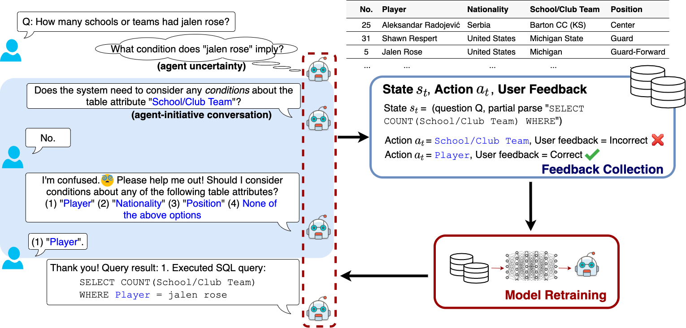

# Model-based Interactive Semantic Parsing (MISP)

This repository provides code implementations for the following papers:
- "[An Imitation Game for Learning Semantic Parsers from User Interaction](https://arxiv.org/pdf/2005.00689.pdf)", EMNLP 2020.
- "[Model-based Interactive Semantic Parsing:
A Unified Framework and A Text-to-SQL Case Study](http://web.cse.ohio-state.edu/~yao.470/paper/MISP_EMNLP19.pdf)", EMNLP 2019.

If you use the data or code from this repository, please cite the papers:
```
@inproceedings{yao2020imitation,
  title={An Imitation Game for Learning Semantic Parsers from User Interaction},
  author={Yao, Ziyu and Tang, Yiqi and Yih, Wen-tau and Sun, Huan and Su, Yu},
  booktitle={Proceedings of the 2020 Conference on Empirical Methods in Natural Language Processing (EMNLP)},
  year={2020}
}

@inproceedings{yao2019model,
  title={Model-based Interactive Semantic Parsing: A Unified Framework and A Text-to-SQL Case Study},
  author={Yao, Ziyu and Su, Yu and Sun, Huan and Yih, Wen-tau},
  booktitle={Proceedings of the 2019 Conference on Empirical Methods in Natural Language Processing and the 9th International Joint Conference on Natural Language Processing (EMNLP-IJCNLP)},
  pages={5450--5461},
  year={2019}
}
```


## 1. Overview
<p align="center">

</p>

Natural language interfaces that allow users to query data and invoke services without programming have been identified as a key application of semantic parsing.
However, existing semantic parsers usually fall short in practice, due to the _high complexity_ and _ambiguity_ of user inputs. In the mean time, there is no an easy way for the user to validate the returned results.
Towards addressing these problems, **interactive semantic parsing** has emerged recently as a promising solution. 
In this paradigm, a semantic parser interacts with the user in multiple turns and solicits new information or help to resolve its uncertainties.
During the interaction, the user is also able to validate the parsing processing, which increases their trust in the system.

To advance this line of research, in [our EMNLP'19 paper](http://web.cse.ohio-state.edu/~yao.470/paper/MISP_EMNLP19.pdf), we proposed **Model-based Interactive Semantic Parsing (MISP)**, a unified framework that views the interactive semantic parsing problem as designing a _model-based_ intelligent agent. 
The following figures show an overview of MISP (left) and its instantiation **MISP-SQL** for text-to-SQL parsing (right).

<p align="center">
 
</p>

In our formulation, a MISP agent maintains an **agent state** and has three major components:
* a **World Model**, which perceives the environment signals (e,g., user initial inputs or follow-up feedback) and interprets the world (e.g., user intents);
* an **Error Detector**, which introspects the agent states and decides whether and where human intervention (e.g., clarification or user help) is needed;
* an **Actuator**, which realizes the agent's action in a user-friendly way, e.g., by generating a natural language question to the user.

**Generalization**: While we instantiate it for text-to-SQL parsing tasks, MISP can also be implemented for other logical forms. It also accepts various base semantic parsers in the back end (see [1.1 Version Logs and Reproducibility](README.md#11-version-logs-and-reproducibility)).

**Discoveries with MISP**
- In [EMNLP'19](http://web.cse.ohio-state.edu/~yao.470/paper/MISP_EMNLP19.pdf), we demonstrate that, by plugging a base semantic parser into MISP in its test time, the parser's accuracy can be improved substantially with a reasonable number of user interactions;
- In [EMNLP'20](https://arxiv.org/pdf/2005.00689.pdf), we show that, after deployment, a semantic parser under MISP can autonomously improve itself by learning from user interaction feedback. This greatly saves _annotation effort_ and is _privacy preserving_ because no extra annotators or developers are involved.


### 1.1 Version Logs and Reproducibility
We are keeping updating the repository. To encourage reproducibility, it currently contains three versions of MISP-SQL implementation:

Date | Branch | Description & Updates | Supported Base Semantic Parsers
------------ | ------------ | ------------- | -------------
Oct. 2019 |`emnlp` | MISP-SQL with binary-choice Q&A interaction, which can be used to reproduce our EMNLP'19 experiments. | [SQLNet](https://arxiv.org/pdf/1711.04436.pdf), [SQLova](https://arxiv.org/pdf/1902.01069.pdf), [SyntaxSQLNet](https://arxiv.org/pdf/1810.05237.pdf)
Oct. 2019 |`multichoice_q` | MISP-SQL with multi-choice Q&A interaction. | [SQLNet](https://arxiv.org/pdf/1711.04436.pdf), [SQLova](https://arxiv.org/pdf/1902.01069.pdf), [SyntaxSQLNet](https://arxiv.org/pdf/1810.05237.pdf)
Oct. 2020 |`multichoice_q_v2` (**default, recommended**) | The latest version of MISP-SQL with multi-choice Q&A interaction. Updates include: <ul><li>Refactored `MISP_SQL` implementation;</li><li>Updated question templates;</li><li>Implementation of interactive learning algorithms for reproducing EMNLP'20 experiments.</li></ul> | [SQLova](https://arxiv.org/pdf/1902.01069.pdf), [EditSQL](https://arxiv.org/pdf/1909.00786.pdf)

To switch to different branches, please try `git checkout branch_name`. Contact us if you have any questions in using our framework!


## 2. Agent Architecture
Our MISP-SQL framework is under the folder [`MISP_SQL`](MISP_SQL/), with [`agent.py`](MISP_SQL/agent.py) being the implemented MISP agent. The interactive semantic parsing session is implemented in the function [`interactive_parsing_session`](MISP_SQL/agent.py#L106). 
As an overview:
* The agent is initially given a SQL query (called `hypothesis`) generated by the base semantic parser;
* The error detector examines (the meta data of) each SQL component (called `semantic unit`) and decides whether to ask the user a question to verify it;
* In every interaction, if the user affirms the current unit, this positive feedback is taken and the parsing continues ([Line 142](MISP_SQL/agent.py#L142)). Otherwise, the agent incoporates the negative feedback, decodes alternative generations for this unit and lets the user decide. This step is realized by conducting `"one-step" beam search` over the current unit while keeping its preceding fixed ([Line 152-159](MISP_SQL/agent.py#L152)). The agent will generate a new hypothesis after receiving the user answers ([Line 202](MISP_SQL/agent.py#L202)). The interaction loop then continues from this new hypothesis.

As elaborated above, there are two "cornerstones" supporting the implementation:
* **Hypthesis**: Any (partial) SQL query is an instance of the class [`Hypothesis`](MISP_SQL/utils.py#L82). A hypothesis mainly stores:
  * `dec_seq`: The sequence of _decoding decisions_ generated while parsing. It allows us to pinpoint previous decisions and make changes in feedback incorporation. *Note that the content in this sequence is specific to the base parser. One can have their own definition as long as it is easy to modify the decisions.*
  * `dec_prefix`: The sequence of _prefix decoding decisions_ that the agent enforces the base parser to take. This will be used in `"one-step" beam search` to keep the preceding decisions fixed. Its format is the same as `dec_seq`.
  * `tag_seq`: The sequence of _semantic units_ generated while parsing. It records every generated SQL component (i.e., every decoding decision) as well as its context, which can be used by the [Error Detector](MISP_SQL/error_detector.py) to identify potential mistakes and the [Question Generator](MISP_SQL/question_gen.py) to formulate natural language questions. See [MISP_SQL/tag_seq_logic.md](MISP_SQL/tag_seq_logic.md) for more details.
  * `logprob` and `length`: The log probability and length of the current (partial) SQL query.
  * `sql`: The generated SQL query in string.
* **Semantic Unit**: A semantic unit defines the minimal unit that the agent should interact on. A complete list of semantic units defined in the current framework can be found in [MISP_SQL/tag_seq_logic.md](MISP_SQL/tag_seq_logic.md). 

### 2.1 Example
NL input: Who are all of the players on the Westchester High School club team?

True SQL: `SELECT player WHERE school/club team = westchester high school`

#### Generation by SQLNet (without interaction)
```python
Before interaction:
initial SQL: SELECT (Player) WHERE School/Club Team = westchester high

logprob: -0.163793454746

# Note that the following units should follow the framework's definitions.
tag_seq: [('O', ('sc', None), 1.0, None), ('O', 'select', 1.0, None), # dummy tags
('SELECT_COL', (None, u'Player', 0), 0.999, 0), # pick a column "Player" (idx 0) in SELECT clause (probability=0.999)
('SELECT_AGG', (None, u'Player', 0), ('none_agg', 0), 0.998, 1), # do not pair any aggregator for "Player" (probability=0.998)
('O', 'where', 1.0, None), # dummy tags
('WHERE_COL', (None, u'School/Club Team', 5), 0.999, 2), # pick a column "School/Club Team" (idx 5) in WHERE clause
('WHERE_OP', ((None, u'School/Club Team', 5),), ('=', 0), 0.999, 3), # pick operator "=" for "School/Club Team"
('WHERE_VAL', ((None, u'School/Club Team', 5),), ('=', 0), ([0, 9, 10, 15], u'westchester high'), 0.852, 4)] # WHERE School/Club Team = westchester high

# Note that the following dec_seq is specific to SQLNet.
dec_seq: [(('sc', None), 0), # for 'sc' (SELECT_COL), take column with idx=0 (i.e., "Player")
(('sa', (0, u'Player')), 0), # for 'sa' (SELECT_AGG), take aggregator with idx=0 (i.e., "none_agg", empty aggregator)
(('wc', None), 1, [5]), # for 'wc' (WHERE_COL), decide the number of conditions #cols=1 and take column with idx=5 (i.e., "School/Club Team")
(('wo', (5, u'School/Club Team')), 0), # for 'wo' (WHERE_OP) corresponding to column "School/Club Team", take operator with idx=0 (i.e., "=")
(('wv', (5, u'School/Club Team', 0, '=')), [0, 9, 10, 15])] # for 'wv' (WHERE_VAL) corresponding to "WHERE School/Club Team =", generate a sequence of words: <SOS>, 'westchester', 'high', <EOS>

# --------------------------------------------------
initial evaluation:
qm correct: 0.0, exe correct: 0.0
```

#### Interaction using MISP-SQL with SQLNet
```python
# The agent decides to validate the WHERE_VAL unit "westchester high".
Semantic Unit: [('WHERE_VAL', ((None, u'School/Club Team', 5),), ('=', 0), ([0, 9, 10, 15], u'westchester high'), 0.852, 4)]
Question: The system considers the following condition: the table attribute "School/Club Team" equals to "westchester high". Is the condition correct?
User answer: no.

# The agent decodes alternative WHERE_VAL while keeping its preceding decisions the same as before. 
# This is done by setting:
#   dec_prefix=[(('sc', None), 0), (('sa', (0, u'Player')), 0), (('wc', None), 1, [5]), (('wo', (5, u'School/Club Team')), 0)] 
# and conducting one-step beam search on the next decoding step about 'wv' (WHERE_VAL).
Question: Please select any options from the following list that the system needs to consider as conditions:
(1) the table attribute "School/Club Team" equals to "westchester high school";
(2) the table attribute "School/Club Team" equals to "westchester high westchester";
(3) the table attribute "School/Club Team" equals to "westchester high high";
(4) None of the above options.
User answer: 1.

# --------------------------------------------------
After interaction:
final SQL: SELECT (Player) WHERE School/Club Team = westchester high school

logprob: -1.91301941393

tag_seq: [('O', ('sc', None), 1.0, None), ('O', 'select', 1.0, None), 
('SELECT_COL', (None, u'Player', 0), 0.999, 0), 
('SELECT_AGG', (None, u'Player', 0), ('none_agg', 0), 0.998, 1), 
('O', 'where', 1.0, None), ('WHERE_COL', (None, u'School/Club Team', 5), 0.999, 2), 
('WHERE_OP', ((None, u'School/Club Team', 5),), ('=', 0), 0.999, 3), 
('WHERE_VAL', ((None, u'School/Club Team', 5),), ('=', 0), ([0, 9, 10, 11, 15], u'westchester high school'), 0.148, 4)]

dec_seq: [(('sc', None), 0), (('sa', (0, u'Player')), 0), (('wc', None), 1, [5]), (('wo', (5, u'School/Club Team')), 0), (('wv', (5, u'School/Club Team', 0, '=')), [0, 9, 10, 11, 15])]

final evaluation:
qm correct: 1.0, exe correct: 1.0
```

### 2.2 How to apply MISP-SQL to other base semantic parsers?
Basically, one can simply inherit the abstract classes defined in [`MISP_SQL`](MISP_SQL/). We use [EditSQL](EditSQL/) as an example and summarize our implementation below:
* Customized semantic unit definition: We extend 8 semantic unit categories in [MISP_SQL/utils.py](MISP_SQL/utils.py#L27) for EditSQL. For example, `SELECT_AGG_v2` extends `SELECT_AGG` with an extra `bool_distinct` to indicate the keyword `DISTINCT` (e.g., `SELECT DISTINCT COL` vs. `SELECT COL`).
* [`world_model.py`](EditSQL/world_model.py): 
  * [`def decode_per_pass`](EditSQL/world_model.py#L29): We implement a one-step beam search decoding function for EditSQL in [EditSQL/model/decoder.py#L467](EditSQL/model/decoder.py#L467). A [customized hypothesis class](EditSQL/model/decoder.py#L25) inherited from the [`MISP_SQL.utils.Hypothesis`](MISP_SQL/utils.py#L82) is also implemented and used in beam search. 
  * `def apply_pos_feedback`, `def apply_neg_feedback`, `def decode_revised_structure` and `def refresh_decoding` are implemented to support feedback incorporation. For example, assume the current partial SQL query is `SELECT COL1`. If the user confirms `MAX(COL2)` as the second element to return in the `SELECT` clause, the [apply_pos_feedback](EditSQL/world_model.py#L66) function updates `dec_prefix` from `SELECT COL1` to `SELECT COL1 , MAX(COL2)`.
* [`environment.py`](EditSQL/environment.py):
  * `class ErrorEvaluator(BaseErrorEvaluator)`: This class is inherited from the [`MISP_SQL.environment.ErrorEvaluator`](MISP_SQL/environment.py#L4) class. One needs to instantiate the function `compare` to simulate user feedback, which compares the generated SQL query (in the form of `tag_seq`) with the gold one and returns the correct selections or semantic unit(s). 
  * `class RealUser(BaseRealUser)`: This class is inherited from the [`MISP_SQL.environment.RealUser`](MISP_SQL/environment.py#L187) class. We extend it with a function `show_table` to present table headers in user study.
* [`question_gen.py`](EditSQL/question_gen.py): This class is inherited from the [`MISP_SQL.question_gen.QuestionGenerator`](MISP_SQL/question_gen.py#L5) class. We extend it with four customized questions.

Other classes, such as `MISP_SQL.error_detector.ErrorDetectorProbability` and `MISP_SQL.agent.Agent`, can be directly used.


## 3. Learning Semantic Parsers from User Interaction
In [our EMNLP'20 paper](https://arxiv.org/pdf/2005.00689.pdf), we study interactively learning semantic parsers from user interaction under the MISP framework. We present an annotation-efficient imitation learning algorithm. Compared with the traditional supervised approach which requires full expert annotations on every user question, our algorithm can train a semantic parser to a comparable performance level and meanwhile requires only 10% of the total annotations that the supervised approach needs.

To reproduce the experimental results, please refer to [SQLova_model README](SQLova_model/) and [EditSQL README](EditSQL/) for details.
