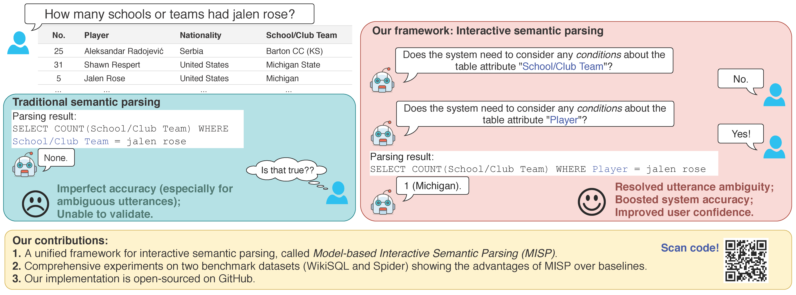
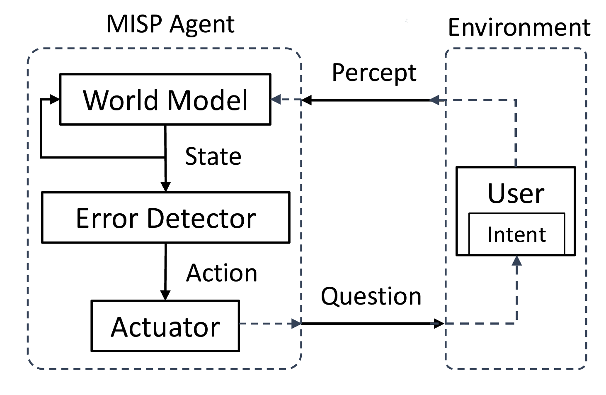
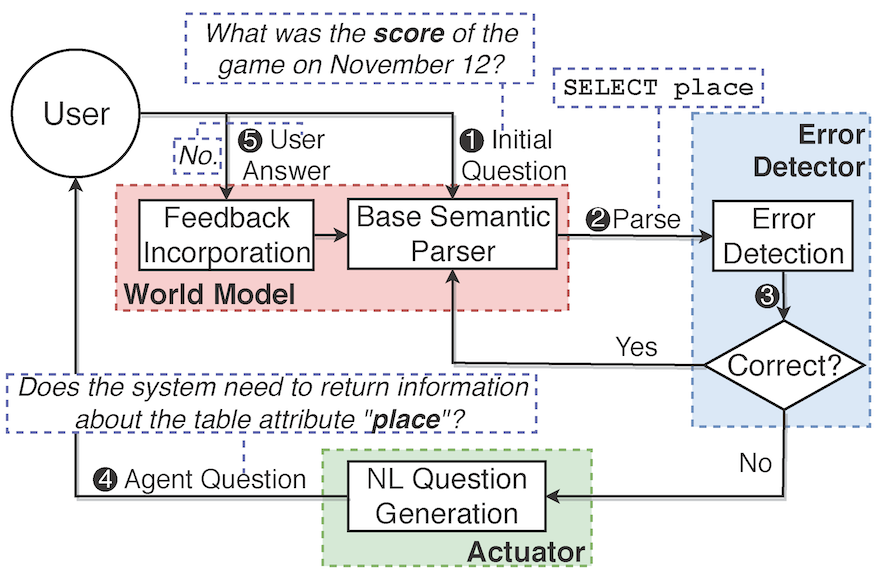

# Model-based Interactive Semantic Parsing (MISP)

This repository provides code implementations for the EMNLP'19 paper "[Model-based Interactive Semantic Parsing:
A Unified Framework and A Text-to-SQL Case Study](http://web.cse.ohio-state.edu/~yao.470/paper/MISP_EMNLP19.pdf)".


## Overview
<p align="center">

</p>


## 1. Introduction
As a promising paradigm, _interactive semantic parsing_ has shown to improve both semantic parsing accuracy and user confidence in the results. To facilitate its research, we propose **Model-based Interactive Semantic Parsing (MISP)**, a unified framework that views the interactive semantic parsing problem as designing a _model-based_ intelligent agent. The following figures show an overview of MISP and its instantiation (**MISP-SQL**) for text-to-SQL parsing.

<p align="center">
 
</p>
<!--
-->

A MISP agent maintains an **agent state** and has three major components:
* **World Model**, which perceives the environment signals and predicts the future based on the agent's internal knowledge.
* **Error Detector**, which introspects its states and decides whether and where human intervention is needed.
* **Actuator**, which realizes the agent's action in a user-friendly way, e.g., by generating a natural language question.

This repository contains the implementation of MISP-SQL when the base semantic parser is SQLNet [(Xu et al., 2017)](https://arxiv.org/pdf/1711.04436.pdf), SQLova [(Hwang et al., 2019)](https://arxiv.org/pdf/1902.01069.pdf) or SyntaxSQLNet [(Yu et al., 2018)](https://arxiv.org/pdf/1810.05237.pdf). However, the framework potentially can also be applied to other base semantic parsers. We provide two versions of implementations:
* Branch `emnlp`: The _original_ version supporting binary-choice Q&A interaction, which can be used to reproduce our EMNLP results. To use this version, please switch the branch by `git checkout emnlp`.
* Branch `multichoice_q` (__default, recommended__): A _refactored_ version supporting multi-choice Q&A interaction. This is the default branch of this repository.

Please cite our work if you use our implementation:
```
@inproceedings{yao-etal-2019-model,
    title = "Model-based Interactive Semantic Parsing: A Unified Framework and A Text-to-{SQL} Case Study",
    author = "Yao, Ziyu  and
      Su, Yu  and
      Sun, Huan  and
      Yih, Wen-tau",
    booktitle = "Proceedings of the 2019 Conference on Empirical Methods in Natural Language Processing and the 9th International Joint Conference on Natural Language Processing (EMNLP-IJCNLP)",
    month = nov,
    year = "2019",
    address = "Hong Kong, China",
    publisher = "Association for Computational Linguistics",
    url = "https://www.aclweb.org/anthology/D19-1547",
    pages = "5450--5461",
}
```

## 2. System Architecture
Our MISP-SQL framework is under the folder "[MISP_SQL](MISP_SQL/)", with [`agent.py`](MISP_SQL/agent.py) being the implemented MISP agent. The interactive semantic parsing session is implemented in the function [`interactive_parsing_session`](MISP_SQL/agent.py#L34). 
As an overview:
* The agent is initially given a SQL query (called `"hypothesis"`) generated by the base semantic parser;
* The error detector examines (the meta data of) each SQL component (called `"semantic unit/segment"`) and decides whether or not to ask the human user a question about this semantic unit. 
* In every interaction, if the user affirms the current unit, this positive feedback is taken and the parsing continues ([Line 65-67](MISP_SQL/agent.py#L65)). Otherwise, the agent incoporates the negative feedback, decodes alternative generations for this unit and lets the user decide. This step is realized by conducting `"one-step" beam search` over the current unit while keeping its preceding fixed ([Line 72-78](MISP_SQL/agent.py#L72)). The agent will generate a new hypothesis after receiving the user answers. The interaction loop then continues from this new hypothesis.

As elaborated above, there are two "cornerstones" supporting the implementation:
* **Hypthesis**: Any (partial) SQL query is an instance of the class [`Hypothesis`](MISP_SQL/utils.py#L71). A hypothesis mainly stores:
  * `dec_seq`: The sequence of _decoding decisions_ generated while parsing. It allows us to pinpoint previous decisions and make changes (i.e., feedback incorporation).
  * `dec_prefix`: The sequence of _prefix decoding decisions_ that the agent enforces the base parser to take. This is used in `"one-step" beam search` to keep the preceding decisions fixed. Its format is the same as `dec_seq`.
  * `tag_seq`: The sequence of _semantic units_ generated while parsing. It records every generated SQL component as well as its context, which can be used by the [Question Generator](MISP_SQL/question_gen.py) to formulate natural language questions. 
  * `logprob` and `length`: The log probability and length of the current (partial) SQL query.
  * `sql`: The generated SQL query in string.
* **Semantic Unit/Segment**: A semantic unit/segment defines the minimal unit that the system should interact on. A complete list of semantic units used in the current system can be found [here](MISP_SQL/utils.py#L6). The rules/logics for recording is explained in [MISP_SQL/semantic_tag_logic.txt](MISP_SQL/semantic_tag_logic.txt). 

### 2.1 Example
NL input: Who are all of the players on the Westchester High School club team?

True SQL: SELECT player WHERE school/club team EQL westchester high school

#### Generation by SQLNet (without interaction)
```python
Before interaction:
initial SQL: SELECT (Player) WHERE School/Club Team = westchester high

logprob: -0.163793454746

tag_seq: [('O', ('sc', None), 1.0, None), ('O', 'select', 1.0, None), # dummy tags
('SELECT_COL', (None, u'Player', 0), 0.9999038, 0), # picking a column "Player" (idx 0) in SELECT clause (probability=0.999)
('SELECT_AGG', (None, u'Player', 0), ('none_agg', 0), 0.99758995, 1), # do not pair any aggregator for "Player" (probability=0.998)
('O', 'where', 1.0, None), # dummy tags
('WHERE_COL', (None, u'School/Club Team', 5), 0.99908423, 2), # picking a column "School/Club Team" (idx 5) in WHERE clause
('WHERE_OP', ((None, u'School/Club Team', 5),), ('=', 0), 0.9999919, 3), # picking operator "=" for "School/Club Team"
('WHERE_VAL', ((None, u'School/Club Team', 5),), ('=', 0), ([0, 9, 10, 15], u'westchester high'), 0.8518489589551428, 4)] # WHERE School/Club Team = westchester high

dec_seq: [(('sc', None), 0), # for 'sc' (SELECT_COL), take column with idx=0 (i.e., "Player")
(('sa', (0, u'Player')), 0), # for 'sa' (SELECT_AGG), take aggregator with idx=0 (i.e., "none_agg", empty aggregator)
(('wc', None), 1, [5]), # for 'wc' (WHERE_COL), decide the number of conditions #cols=1 and take column with idx=5 (i.e., "School/Club Team")
(('wo', (5, u'School/Club Team')), 0), # for 'wo' (WHERE_OP) corresponding to column "School/Club Team", take operator with idx=0 (i.e., "=")
(('wv', (5, u'School/Club Team', 0, '=')), [0, 9, 10, 15])] # for 'wv' (WHERE_VAL) corresponding to "WHERE School/Club Team =", generate a sequence of words: <SOS>, 'westchester', 'high', <EOS>

# --------------------------------------------------
initial evaluation:
qm correct: 0.0, exe correct: 0.0
```

#### Interaction using MISP-SQL with SQLNet
```python
# The agent decides to validate the WHERE_VAL unit "westchester high".
SU: [('WHERE_VAL', ((None, u'School/Club Team', 5),), ('=', 0), ([0, 9, 10, 15], u'westchester high'), 0.8518489589551428, 4)]
Question: The system considers the following condition: the table attribute "School/Club Team" equals to "westchester high". Is the condition correct?
User answer: no.

# The agent decodes alternative WHERE_VAL while keeping its preceding decisions the same as before. 
# This is done by setting dec_prefix=[(('sc', None), 0), (('sa', (0, u'Player')), 0), (('wc', None), 1, [5]), (('wo', (5, u'School/Club Team')), 0)] 
# and conducting one-step beam search on the next decoding step 'wv'.
Question: Please select any options from the following list that the system needs to consider as conditions:
(1) the table attribute "School/Club Team" equals to "westchester high school";
(2) the table attribute "School/Club Team" equals to "westchester high westchester";
(3) the table attribute "School/Club Team" equals to "westchester high high";
(4) None of the above options.
User answer: 1.

# --------------------------------------------------
After interaction:
final SQL: SELECT (Player) WHERE School/Club Team = westchester high school

logprob: -1.91301941393

tag_seq: [('O', ('sc', None), 1.0, None), ('O', 'select', 1.0, None), 
('SELECT_COL', (None, u'Player', 0), 0.9999038, 0), 
('SELECT_AGG', (None, u'Player', 0), ('none_agg', 0), 0.99758995, 1), 
('O', 'where', 1.0, None), ('WHERE_COL', (None, u'School/Club Team', 5), 0.99908423, 2), 
('WHERE_OP', ((None, u'School/Club Team', 5),), ('=', 0), 0.9999919, 3), 
('WHERE_VAL', ((None, u'School/Club Team', 5),), ('=', 0), ([0, 9, 10, 11, 15], u'westchester high school'), 0.14814377778482996, 4)]

dec_seq: [(('sc', None), 0), (('sa', (0, u'Player')), 0), (('wc', None), 1, [5]), (('wo', (5, u'School/Club Team')), 0), (('wv', (5, u'School/Club Team', 0, '=')), [0, 9, 10, 11, 15])]

final evaluation:
qm correct: 1.0, exe correct: 1.0
```

### 2.2 How to apply MISP-SQL to other base semantic parsers?
Basically, one can simply inherit the abstract classes defined in [MISP_SQL](MISP_SQL/). We use [SQLNet](SQLNet_model/) as an example and summarize our coding work below:
* [`world_model.py`](SQLNet_model/world_model.py): 
  * `def decode_per_pass`: To support (one-step) beam search, we adapt the SQLNet's non-interactive forward implementation ([Line 129](SQLNet_model/sqlnet/model/sqlnet.py#L129)) into interactive beam search ([Line 184](SQLNet_model/sqlnet/model/sqlnet.py#L184)). A customized hypothesis inherited from the [`Hypothesis`](MISP_SQL/utils.py#L71) class is used in beam search. 
  * `def apply_pos_feedback`, `def apply_neg_feedback` and `def decode_revised_structure` are implemented to support feedback incorporation.
* [`environment.py`](SQLNet_model/environment.py):
  * `class ErrorEvaluator(BaseErrorEvaluator)`: This class is inherited from the [`ErrorEvaluator`](MISP_SQL/environment.py#L4) class in MISP_SQL. One needs to implement the function `compare` to simulate the user's feedback (given she knows the ground truth, simply comparing the generated query with the ground truth).
  * `class RealUser(BaseRealUser)`: This class is inherited from the [`RealUser`](MISP_SQL/environment.py#L82) class in MISP_SQL. We extend it with a function `show_table` to present table headers in user study.

Other classes, such as `MISP.QuestionGenerator`, `MISP.ErrorDetectorProbability` and `MISP.Agent`, can be directly used.


## 3. Experiments
Our experiments involve three different base semantic parsers: SQLNet, SQLova and SyntaxSQLNet. This section shows how to run MISP with each of the base semantic parsers.

### 3.1 MISP with SQLNet
#### Requirements
* Python 2.7
* Pytorch 0.2.0
* Please follow [SQLNet's instruction](https://github.com/xiaojunxu/SQLNet#installation) to install other dependencies.

Note: It is recommended to create a conda environment ([download](https://www.anaconda.com/distribution/), [usage](https://docs.conda.io/projects/conda/en/latest/user-guide/tasks/manage-environments.html)) to install the above packages. If you do so, you may put your environment name [here](interaction_SQLNet.sh#L3), i.e., `source activate ENV_NAME`.

#### Data preparation
Please download the `.tar` file from [here](https://www.dropbox.com/s/rjaz5t3mnj84tpk/sources.tar?dl=0) and uncompress it under the folder `SQLNet_model`. This file has included necessary data as well as pretrained models.
<!-- You should see the following file structure:
```
|-- SQLNet_model
|   |-- data
|       |-- test.db
|       |-- ...
|   |-- glove
|       |-- usedwordemb.npy
|       |-- word2idx.json
|   |-- saved_model
|       |-- old_sqlnet_train_emb_ca.agg_embed
|       |-- ...
```-->

#### To run the interactive system
Under the main directory (please revise the output paths accordingly before running the script):
```
bash interaction_SQLNet.sh
```


### 3.2 MISP with SQLova
#### Requirements
* Python 3.6
* Pytorch 1.0.1
* Please follow [SQLova's instruction](https://github.com/naver/sqlova#requirements) to install other dependencies.
Note: If you have created a new conda environment to install the above packages, please put its name [here](interaction_sqlova.sh#L3), i.e., `source activate ENV_NAME`.

#### Data preparation
Please download the `.tar` file from [here](https://www.dropbox.com/s/p1q59bpzjyk0h5e/sources.tar?dl=0) and uncompress it under the folder `SQLova_model`. This file has included necessary data as well as pretrained models.
<!--You should see the following file structure:
```
|-- SQLova_model
|   |-- checkpoints_0416
|       |-- model_bert_best.pt
|       |-- model_best.pt
|   |-- download
|       |-- bert
|           |-- bert_config_uncased_L-12_H-768_A-12.json
|           |-- ...
|       |-- data
|           |-- test.db
|           |-- ...
```-->

#### To run the interactive system
Under the main directory (please revise the output paths accordingly before running the script):
```
bash interaction_sqlova.sh
```

### 3.3 MISP with SyntaxSQLNet
#### Requirements
* Python 2.7
* Pytorch 0.2.0

(You can use the same environment as SQLNet for running SyntaxSQLNet).

#### Data preparation
Please download the `.tar` file from [here](https://www.dropbox.com/s/vi65ezm8k1j92zd/sources.tar?dl=0) and uncompress it under the folder `syntaxSQL`. This file has included necessary data as well as pretrained models. Please also download and unzip the pretrained [Glove](https://nlp.stanford.edu/data/wordvecs/glove.42B.300d.zip), and put it as `syntaxSQL/glove/glove.42B.300d.txt`. 
<!--You should see the following file structure:
```
|-- syntaxSQL
|   |-- data
|   |-- generated_datasets
|       |-- generated_data
|           |-- ...
|   |-- glove
|       |-- glove.42B.300d.txt
```-->

#### To run the interactive system
Under the main directory (please revise the output paths accordingly before running the script):
```
bash interaction_syntaxSQL.sh
```

## 4. Acknowledgement
The implementations of MISP-SQL applied to SQLNet, SQLova and SyntaxSQLNet are adapted from their non-interactive implementations: 
* [SQLNet](https://github.com/xiaojunxu/SQLNet)
* [SQLova](https://github.com/naver/sqlova)
* [SyntaxSQLNet](https://github.com/taoyds/syntaxSQL)


